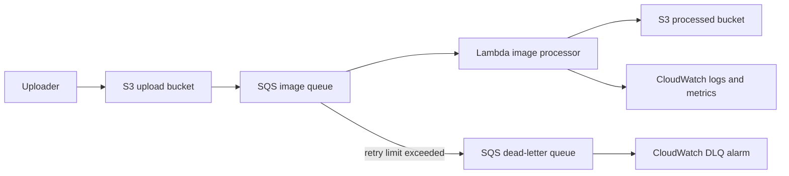

# AWS Event-Driven Image Pipeline

A **YourCloudDude** learner project for understanding how to build a resilient event-driven image-processing workflow on AWS.

> Upload an image. Buffer the event. Process it asynchronously. Make failures visible.

This project intentionally focuses on a small set of services and the engineering decisions between them:

- **Amazon S3** for source and processed images
- **Amazon SQS** for buffering and retry isolation
- **AWS Lambda** for image processing
- **Amazon CloudWatch** for logs, metrics, and a DLQ alarm
- **AWS IAM** for least-privilege access
- **AWS SAM** for reviewable infrastructure as code

## What You Will Learn

By building and reading this project, you should be able to explain:

- why SQS sits between S3 and Lambda
- how asynchronous retries differ from synchronous request handling
- how dead-letter queues make failed work inspectable
- how Lambda partial-batch failure reporting prevents successful SQS messages from being retried
- how deterministic output keys make repeated events safer
- how source ETags can be used to avoid unnecessary duplicate processing
- how IAM permissions map to each step of the data flow
- where backpressure appears when uploads outpace processing
- how byte and decoded-pixel limits protect a memory-bound image worker
- which AWS resources create cost and how to clean them up

## Architecture



### Why put SQS between S3 and Lambda?

S3 can invoke Lambda directly, but the queue gives this learning architecture an explicit buffer.

That means:

1. uploads do not require the processor to be immediately available
2. bursts can wait in the queue instead of being lost
3. failed messages can be retried independently
4. messages that repeatedly fail can move to a DLQ for investigation
5. Lambda concurrency can be controlled separately from the upload rate

The trade-off is additional latency, another service to operate, and SQS request cost.

## Processing Flow

1. A user uploads an object to the source S3 bucket.
2. S3 sends an object-created event to the SQS queue.
3. Lambda polls SQS in batches.
4. The function decodes the S3 event contained in each SQS message.
5. Unsupported file extensions are ignored rather than retried forever.
6. For supported images, Lambda checks whether the deterministic output already exists for the same source ETag.
7. If work is needed, Lambda downloads the image and enforces both compressed-byte and decoded-pixel limits before fully loading it into memory.
8. The image is resized while preserving aspect ratio, converted to JPEG, and uploaded to the processed bucket.
9. Successful SQS messages are deleted by the event-source mapping.
10. Failed messages are returned through partial-batch failure reporting and retried.
11. Messages that exceed the queue retry policy move to the DLQ.

## Image Safety Limits

Compressed file size alone is not enough to protect an image worker. A relatively small compressed image can decode into a very large pixel buffer and consume far more memory than its object size suggests.

This project therefore applies two independent limits before processing completes:

- `MAX_IMAGE_BYTES`: maximum source payload size, default **10 MiB**
- `MAX_IMAGE_PIXELS`: maximum decoded dimensions multiplied together, default **20,000,000 pixels**

The pixel limit is checked immediately after Pillow reads the image header and before `source.load()` decodes the full image. Inputs above either limit fail the SQS message and follow the normal retry/DLQ path.

These defaults are teaching safeguards, not universal production values. Tune them against Lambda memory, expected image formats, workload characteristics, and the failure policy of the real system.

## Idempotency Strategy

S3 and SQS are asynchronous systems, so duplicate delivery is possible.

This project uses two simple techniques:

- a **deterministic output key** derived from the source object key
- the source object's **ETag stored as S3 object metadata**

Before processing, the function checks the existing output. If its stored source ETag matches the incoming event, the function treats the message as already processed.

This does not make every possible image workflow exactly-once. It demonstrates how to design operations so duplicate delivery is less harmful.

## Repository Layout

```text
.
├── .github/workflows/ci.yml
├── docs/
│   ├── architecture.md
│   └── troubleshooting.md
├── events/
│   └── sqs-s3-event.json
├── src/
│   ├── app.py
│   └── requirements.txt
├── tests/
│   └── test_app.py
├── .gitignore
├── CONTRIBUTING.md
├── pyproject.toml
├── requirements-dev.txt
├── template.yaml
└── README.md
```

## Prerequisites

For local validation:

- Python 3.12+
- pip

For AWS deployment:

- an AWS account
- AWS CLI configured with credentials you control
- AWS SAM CLI

Deploying this project can create billable AWS resources.

## Local Setup

```bash
python -m venv .venv
source .venv/bin/activate
pip install -r requirements-dev.txt
```

On Windows PowerShell:

```powershell
.venv\Scripts\Activate.ps1
pip install -r requirements-dev.txt
```

Run the quality checks:

```bash
ruff check .
python -m compileall src tests
pytest -q
sam validate --lint
sam build
```

## Deploy with AWS SAM

First build the application:

```bash
sam build
```

Then deploy interactively:

```bash
sam deploy --guided
```

SAM will ask for two globally unique S3 bucket names:

- `UploadBucketName`
- `ProcessedBucketName`

A practical naming pattern is:

```text
your-unique-prefix-image-pipeline-uploads
your-unique-prefix-image-pipeline-processed
```

Do not use the example literally if someone else already owns those bucket names.

## Try the Pipeline

After deployment, read the stack outputs to find the source and processed bucket names.

Upload a JPEG or PNG:

```bash
aws s3 cp ./photo.jpg s3://YOUR_UPLOAD_BUCKET/demo/photo.jpg
```

Then inspect the processed bucket:

```bash
aws s3 ls s3://YOUR_PROCESSED_BUCKET/processed/ --recursive
```

The processor writes JPEG output under a deterministic `processed/` prefix while preserving the source key path.

## Failure Handling

The queue uses a retry policy before moving repeatedly failing messages to the DLQ.

Examples of failures that can reach the DLQ include:

- corrupt image bytes
- images above the configured byte-size limit
- images above the configured decoded-pixel limit
- temporary S3 permission/configuration errors
- unexpected processor exceptions

The Lambda handler uses **partial batch responses**. If a batch contains five SQS messages and only one fails, only that message should be retried.

The template also creates a CloudWatch alarm that enters the `ALARM` state when the DLQ contains visible messages. It does not send notifications by itself; adding an SNS or incident-management destination is a useful extension exercise.

## Security Notes

The template and processor are intentionally conservative:

- both buckets block public access
- S3 server-side encryption is enabled
- SQS managed encryption is enabled
- the SQS queue policy limits S3 `SendMessage` access to the configured upload bucket and AWS account
- Lambda receives read access only to the upload bucket
- Lambda receives read/write access only to the processed bucket
- Lambda receives SQS polling permissions only for the image queue
- compressed-byte and decoded-pixel limits reduce memory-exhaustion risk from hostile or pathological images
- no application secrets are stored in the repository

Before adapting this pattern for a real product, consider malware scanning, stricter content validation, object ownership requirements, KMS key policies, lifecycle policies, access logging, alarms with notification targets, and account-level guardrails.

## Reliability and Scaling Notes

### Backpressure

If uploads arrive faster than Lambda can process them, SQS absorbs the difference. Queue depth and message age become important operational signals.

### Lambda concurrency

The SAM template caps SQS-triggered Lambda concurrency so a sudden upload burst does not create unconstrained processing concurrency.

### Visibility timeout

The queue visibility timeout is longer than the Lambda timeout. This reduces the chance of the same message becoming visible while the current invocation is still processing it.

### Poison messages

Messages that repeatedly fail move to the DLQ instead of retrying forever.

## Cost Awareness

Potential charges include:

- S3 storage and requests
- SQS requests
- Lambda invocations, duration, and memory
- CloudWatch logs, metrics, and alarms
- data transfer depending on how the project is used

For a small learning workload the cost can be low, but it is not guaranteed to be free. Check current AWS pricing for your region before deployment.

## Clean Up

Empty both S3 buckets before deleting the stack, because CloudFormation cannot delete non-empty buckets.

```bash
aws s3 rm s3://YOUR_UPLOAD_BUCKET --recursive
aws s3 rm s3://YOUR_PROCESSED_BUCKET --recursive
sam delete
```

Also inspect the DLQ if you intentionally generated failures while learning.

## Useful Extension Challenges

1. publish DLQ alarms to SNS
2. add image dimensions and processing duration as custom metrics
3. add a DynamoDB processing ledger and compare it with the ETag approach
4. add object lifecycle rules to control storage cost
5. support WebP output and compare size/quality trade-offs
6. separate thumbnail and full-size processing queues
7. add reserved concurrency and load-test the backpressure behavior
8. add a quarantine path for invalid or suspicious files
9. use a customer-managed KMS key and document the key policy
10. add EventBridge for richer event routing and explain when it is preferable to direct S3 notifications

## Interview Questions

After completing the project, try answering these without reading the code:

1. Why use SQS instead of invoking Lambda directly from S3?
2. What happens when the Lambda function fails three times for the same message?
3. Why should the SQS visibility timeout exceed the Lambda timeout?
4. What problem does partial-batch failure reporting solve?
5. Why can duplicate processing happen in an event-driven system?
6. How does this project reduce the impact of duplicate S3 events?
7. What happens if image uploads arrive faster than Lambda can process them?
8. Why is a compressed-byte limit insufficient for image-processing safety?
9. Which IAM permissions does Lambda actually need?
10. What would you change before adapting this design for sensitive user uploads?

## About YourCloudDude

YourCloudDude creates practical AWS, cloud, and Python projects focused on understanding real engineering decisions through implementation.

**Website:** https://yourclouddude.com/

---

**Build it. Understand it. Explain it.**
