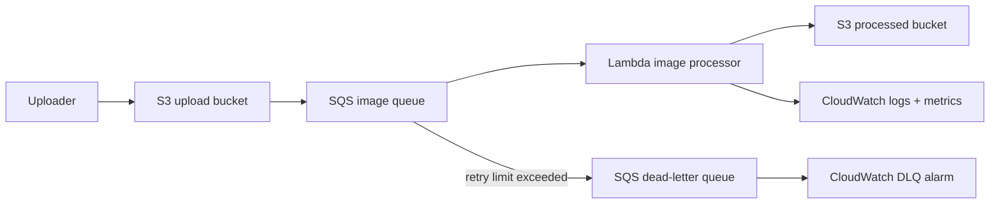

<div align="center">


**Upload an image to S3, let work wait safely in SQS, process it with Lambda, and make failure visible instead of pretending it never happens.**

[](https://github.com/yourclouddude)
[](https://yourclouddude.com/)

</div>

---

## Why this project exists

The obvious image-processing architecture is:

```text
S3 → Lambda
```

That can be perfectly valid. This project deliberately inserts **SQS** because the interesting learning starts when you ask what happens if uploads arrive faster than the worker can process them, one image fails repeatedly, or AWS delivers the same event more than once.

The project is about **backpressure, retries, duplicate delivery, failure isolation, bounded concurrency, and observability** as much as it is about image resizing.

## Architecture



| Service | Responsibility |
|---|---|
| S3 | Stores original and processed images |
| SQS | Buffers work and owns the retry boundary |
| Lambda | Processes images in controlled batches |
| DLQ | Isolates poison messages after repeated failure |
| CloudWatch | Logs, service metrics, and DLQ visibility |
| IAM | Restricts the worker to the resources it needs |
| AWS SAM | Defines the stack as reviewable infrastructure code |

## Why SQS is in the middle

Putting SQS between S3 and Lambda creates a durable place for unfinished work to wait.

That changes the system in useful ways:

- bursts become queue depth instead of instant Lambda pressure
- uploads do not depend on immediate processor availability
- failed messages can retry independently
- poison messages eventually move to a DLQ
- consumer concurrency can be controlled without changing the producer

The trade-off is extra latency, configuration, and another AWS service to understand. That trade-off is the point of the project.

## What happens after an upload

1. An image is uploaded to the source bucket.
2. S3 sends an object-created event to SQS.
3. Lambda polls the queue in small batches.
4. The worker unwraps the S3 event from the SQS message.
5. Unsupported extensions are acknowledged and skipped.
6. The worker checks whether deterministic output already exists for the same source ETag.
7. It validates both compressed size and decoded pixel count.
8. The image is resized while preserving aspect ratio, converted to JPEG, and written to the processed bucket.
9. Successful queue messages are removed automatically.
10. Failed items are returned using partial-batch failure reporting.
11. Messages that repeatedly fail eventually move to the DLQ.

## Two safety limits that matter

A compressed file-size limit alone is not enough. A small compressed image can decode into a very large bitmap and exhaust Lambda memory.

```text
MAX_IMAGE_BYTES  = 10 MiB
MAX_IMAGE_PIXELS = 20,000,000
```

The byte limit protects the download path. The pixel limit is checked after Pillow reads the image header but before full decoding.

These values are learning-project defaults—not universal production limits.

## Duplicate events are normal

This pipeline does not assume exactly-once delivery.

The output key is deterministic, and the processed object stores the source ETag in metadata. If the same source event arrives again, the worker can skip unnecessary work when the existing output matches.

That reduces duplicate work without pretending exactly-once processing exists. Two matching events can still race, and an S3 ETag is not a universal content hash.

A DynamoDB processing ledger with conditional writes would be a reasonable next step if stronger coordination were required.

## Run locally

Requires Python 3.12+.

```bash
python -m venv .venv
source .venv/bin/activate
pip install -r requirements-dev.txt
```

Windows PowerShell:

```powershell
.venv\Scripts\Activate.ps1
pip install -r requirements-dev.txt
```

Run the same checks used in CI:

```bash
ruff check .
python -m compileall src tests
pytest -q
sam validate --lint
sam build
```

## Deploy

You need an AWS account, AWS CLI credentials you control, and AWS SAM CLI.

```bash
sam build
sam deploy --guided
```

SAM asks for two globally unique bucket names:

```text
UploadBucketName
ProcessedBucketName
```

A readable naming pattern works well:

```text
your-unique-prefix-image-pipeline-uploads
your-unique-prefix-image-pipeline-processed
```

Upload a test image:

```bash
aws s3 cp ./photo.jpg s3://YOUR_UPLOAD_BUCKET/demo/photo.jpg
```

Inspect output:

```bash
aws s3 ls s3://YOUR_PROCESSED_BUCKET/processed/ --recursive
```

## Failure is part of the design

A corrupt image, oversized input, temporary S3 problem, or unexpected processor error should not silently disappear.

The queue retries failed messages. After the configured receive limit, the message moves to the DLQ. A CloudWatch alarm watches for visible DLQ messages so failure becomes something you can investigate.

The project also uses **partial batch failure reporting**. If Lambda receives five SQS messages and only one fails, the handler reports that one message ID so the four successful items are not processed again unnecessarily.

## Security boundaries

The worker can:

- read source objects from the upload bucket
- inspect existing processed objects for duplicate checks
- write new objects to the processed bucket
- poll only the image queue

The queue policy allows S3 to send messages only from the configured upload bucket and AWS account. Both buckets block public access. S3 server-side encryption and SQS managed encryption are enabled.

No AWS credentials belong in this repository.

## Backpressure & scaling

If uploads arrive faster than Lambda can process them, SQS holds the backlog. Queue depth and message age become visible signals instead of hidden pressure.

The SAM template caps SQS-triggered Lambda concurrency at five. Five is not a magic production value; it is a teaching safeguard that demonstrates how consumer concurrency can be bounded independently from upload rate.

The queue visibility timeout is also longer than the Lambda timeout so a message is less likely to become visible again while the current invocation is still processing it.

## What this project deliberately does not add

The base architecture does **not** add EventBridge, Step Functions, DynamoDB, SNS, CloudFront, or API Gateway simply to make the diagram larger.

For real untrusted user uploads, you would still need to think about malware scanning, deeper content validation, lifecycle policies, notification routing, access logging, account guardrails, KMS requirements, and product-specific security controls.

## Experiments to try next

1. Add an SNS destination to the DLQ alarm.
2. Add a queue-age alarm and compare it with queue depth.
3. Replace the ETag duplicate check with a DynamoDB processing ledger.
4. Add lifecycle rules and measure storage-cost impact.
5. Add WebP output and compare size, quality, and processing time.
6. Load-test the queue while changing Lambda concurrency.

## Questions you should be able to answer

- Why is SQS between S3 and Lambda?
- What happens to one bad message in a batch?
- Why should the visibility timeout exceed the Lambda timeout?
- Why is compressed file size not enough protection?
- Where can duplicate processing still happen?
- What signal shows the processor is falling behind?
- Which permissions belong to Lambda, and which belong to S3?
- What changes if uploads come from untrusted users?

## Repository layout

```text
.
├── .github/workflows/ci.yml
├── docs/
│   ├── architecture.md
│   └── troubleshooting.md
├── events/
│   └── sqs-s3-event.json
├── src/
│   ├── app.py
│   └── requirements.txt
├── tests/
│   └── test_app.py
├── CONTRIBUTING.md
├── pyproject.toml
├── requirements-dev.txt
├── template.yaml
└── README.md
```

Read [`docs/architecture.md`](docs/architecture.md) for deeper trade-offs and [`docs/troubleshooting.md`](docs/troubleshooting.md) for failure investigation.

## Cost & cleanup

The main cost drivers are S3 storage/requests, SQS requests, Lambda execution, CloudWatch usage, and data transfer.

Empty both buckets first:

```bash
aws s3 rm s3://YOUR_UPLOAD_BUCKET --recursive
aws s3 rm s3://YOUR_PROCESSED_BUCKET --recursive
```

Then delete the stack:

```bash
sam delete
```

CloudFormation cannot remove a non-empty S3 bucket, which is why cleanup is a two-step process.

---

<div align="center">

### YourCloudDude

**Build it. Break a message on purpose. Watch it retry. Understand why.**

[](https://yourclouddude.com/)


</div>