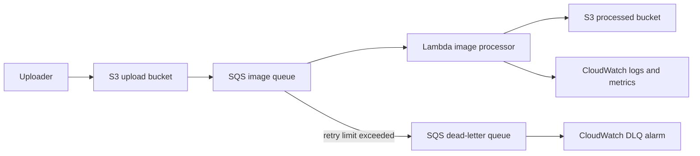

# AWS Event-Driven Image Pipeline

Upload an image to S3, let the work wait safely in SQS, process it with Lambda, and make failures visible instead of pretending they never happen.

This is a **YourCloudDude** project for learning event-driven AWS architecture by building a small system you can actually reason about.

The obvious version of this project is:

```text
S3 -> Lambda
```

That is perfectly valid for many workloads. We deliberately put **SQS in the middle** because the interesting part of this project is not image resizing. It is what happens when uploads arrive faster than your worker can process them, when one image keeps failing, or when AWS delivers the same event more than once.

## Architecture



The services are intentionally limited to a few that each have a clear job:

- **S3** stores the original and processed images.
- **SQS** absorbs bursts and owns the retry boundary.
- **Lambda** does the image work.
- **CloudWatch** gives us logs, service metrics, and a DLQ alarm.
- **IAM** keeps the worker scoped to the buckets and queue it actually needs.
- **AWS SAM** makes the whole setup reviewable as code.

## Why SQS is here

If S3 invokes Lambda directly, the architecture is shorter. With SQS between them, we get a place where unfinished work can wait.

That changes the failure model in useful ways:

- uploads do not depend on the processor being immediately available
- bursts become queue depth instead of instant Lambda pressure
- failed messages can be retried independently
- poison messages eventually move to a DLQ
- Lambda concurrency can be controlled without changing the producer

The trade-off is extra latency, extra configuration, and another AWS service to pay attention to. That trade-off is exactly what this repo is meant to teach.

## What actually happens after an upload

1. An image is uploaded to the source bucket.
2. S3 sends an object-created event to SQS.
3. Lambda polls the queue in small batches.
4. The worker unwraps the S3 event from the SQS message.
5. Unsupported extensions are acknowledged and skipped instead of being retried forever.
6. For a supported image, the worker checks whether the deterministic output already exists for the same source ETag.
7. If work is needed, it downloads the object and checks both compressed size and decoded pixel count.
8. The image is resized while preserving aspect ratio, converted to JPEG, and written to the processed bucket.
9. Successful SQS messages are removed automatically by the event-source mapping.
10. Failed messages are returned through partial-batch failure reporting, so only the failed message is retried.
11. A message that keeps failing is eventually moved to the DLQ.

## Two limits we would not skip

A 10 MiB file limit sounds like enough protection until you remember that compressed image size and decoded image size are different things.

A small compressed image can expand into a very large in-memory bitmap. In a Lambda function, that can turn into a memory problem quickly.

The worker therefore uses two separate limits:

```text
MAX_IMAGE_BYTES   = 10 MiB
MAX_IMAGE_PIXELS  = 20,000,000
```

The byte limit protects the download path. The pixel limit is checked after Pillow reads the image header but **before** the full image is decoded.

These are sensible defaults for a learning project, not universal production numbers. If you adapt this design, choose limits from your Lambda memory, expected formats, traffic, and failure policy.

## Duplicate events are normal

This pipeline does not assume exactly-once delivery.

The output key is deterministic, and the processed object stores the source ETag in metadata. When the same source event arrives again, the worker can check the existing output and skip unnecessary work if the ETag matches.

That makes duplicate delivery less harmful, but it is not magic exactly-once processing. Two matching events can still race, and an S3 ETag is not a universal content hash for every upload method.

If a workflow genuinely needs stronger coordination, adding a DynamoDB processing ledger with conditional writes would be a reasonable next step. We left it out here because it would solve a different problem and make the base architecture harder to see.

## Run it locally

You need Python 3.12+ for the local checks.

```bash
python -m venv .venv
source .venv/bin/activate
pip install -r requirements-dev.txt
```

On Windows PowerShell:

```powershell
.venv\Scripts\Activate.ps1
pip install -r requirements-dev.txt
```

Then run the same checks used in CI:

```bash
ruff check .
python -m compileall src tests
pytest -q
sam validate --lint
sam build
```

## Deploy it

You will need an AWS account, AWS CLI credentials you control, and AWS SAM CLI.

Build first:

```bash
sam build
```

Then deploy interactively:

```bash
sam deploy --guided
```

SAM asks for two globally unique bucket names:

```text
UploadBucketName
ProcessedBucketName
```

A naming pattern such as this is easier to reason about than random names:

```text
your-unique-prefix-image-pipeline-uploads
your-unique-prefix-image-pipeline-processed
```

After the stack is up, upload a JPEG or PNG:

```bash
aws s3 cp ./photo.jpg s3://YOUR_UPLOAD_BUCKET/demo/photo.jpg
```

Then inspect the processed bucket:

```bash
aws s3 ls s3://YOUR_PROCESSED_BUCKET/processed/ --recursive
```

The result is written as JPEG under a deterministic `processed/` path derived from the source key.

## Failure is part of the design

A corrupt image, an image above the byte or pixel limit, a temporary S3 problem, or an unexpected processor error should not quietly disappear.

The queue retries failed messages. After the configured receive limit, the message moves to the DLQ. A CloudWatch alarm watches for visible DLQ messages so the failure becomes something you can investigate.

The alarm intentionally has no SNS destination. For a learning repo, we would rather make the alerting boundary obvious than pretend there is a complete incident-management system here.

One detail worth noticing in the code is **partial batch failure reporting**. If Lambda receives five SQS messages and one fails, the handler reports only that message ID. The four successful messages do not need to be processed again.

## IAM choices

The worker can:

- read source objects from the upload bucket
- read existing outputs from the processed bucket for duplicate checks
- write new objects to the processed bucket
- poll only the image queue

The SQS queue policy allows S3 to send messages only from the configured upload bucket and AWS account.

Both buckets block public access. S3 server-side encryption and SQS managed encryption are enabled. No AWS credentials belong in this repository.

## What this project does not pretend to solve

This is an engineering learning project, not a finished image platform.

Before using a similar design for real user uploads, we would still think about things such as malware scanning, content validation, lifecycle policies, KMS requirements, notification routing, access logging, account guardrails, and the security implications of the actual product.

We also deliberately did **not** add EventBridge, Step Functions, DynamoDB, SNS, CloudFront, or API Gateway just to make the diagram look more impressive. Each of those can be useful, but none is required to understand the core queue-based processing pattern.

## Backpressure and scaling

If uploads arrive faster than Lambda can process them, SQS holds the backlog. Queue depth and message age then become useful signals instead of hidden pressure.

The SAM template caps SQS-triggered Lambda concurrency at five. There is nothing special about five. It is a teaching safeguard that keeps a learner deployment bounded while still showing how consumer concurrency can be controlled independently from upload rate.

The queue visibility timeout is also longer than the Lambda timeout so a message is less likely to become visible again while its current invocation is still working.

## Cost and cleanup

This project can create billable AWS resources. The main cost drivers are S3 storage and requests, SQS requests, Lambda duration and invocations, CloudWatch usage, and any data transfer your test generates.

We do not put a fake monthly price in the README because region, traffic, object size, and current AWS pricing all change the answer.

When you are finished, empty both buckets first:

```bash
aws s3 rm s3://YOUR_UPLOAD_BUCKET --recursive
aws s3 rm s3://YOUR_PROCESSED_BUCKET --recursive
```

Then delete the stack:

```bash
sam delete
```

CloudFormation cannot remove a non-empty S3 bucket, which is why cleanup is a two-step process here.

## If you want to push it further

Good next experiments are the ones that change an engineering decision rather than just add another logo to the diagram:

1. Add an SNS destination to the DLQ alarm and decide who should receive it.
2. Add a queue-age alarm and compare it with simply watching queue depth.
3. Replace the ETag duplicate check with a DynamoDB processing ledger and document what improves and what becomes more complex.
4. Add lifecycle rules and measure how they change storage cost over time.
5. Add WebP output and compare quality, size, and processing time with JPEG.
6. Load-test the queue and experiment with Lambda concurrency while watching message age.

## Questions worth being able to answer

After you build the project, try explaining these without opening the README:

- Why is SQS between S3 and Lambda instead of using direct invocation?
- What happens to one bad image in a batch of otherwise valid messages?
- Why must the SQS visibility timeout be longer than the Lambda timeout?
- Why is a compressed-byte limit not enough for image safety?
- Where can duplicate processing still happen despite the ETag check?
- What signal would tell you the processor is falling behind uploads?
- Which IAM permissions belong to Lambda, and which permission belongs to S3?
- What would you add first if this pipeline started receiving untrusted customer uploads?

## Repository layout

```text
.
├── .github/workflows/ci.yml
├── docs/
│   ├── architecture.md
│   └── troubleshooting.md
├── events/
│   └── sqs-s3-event.json
├── src/
│   ├── app.py
│   └── requirements.txt
├── tests/
│   └── test_app.py
├── CONTRIBUTING.md
├── pyproject.toml
├── requirements-dev.txt
├── template.yaml
└── README.md
```

For failure investigation, see [`docs/troubleshooting.md`](docs/troubleshooting.md). For the deeper architecture trade-offs, see [`docs/architecture.md`](docs/architecture.md).

## About YourCloudDude

**YourCloudDude** builds practical AWS, cloud, and Python projects around one idea: the code matters, but understanding why the system is shaped that way matters more.

Website: https://yourclouddude.com/

---

Build it, break a message on purpose, watch it retry, inspect the DLQ, and then change one design decision. That will teach you more about event-driven AWS than simply getting a green deployment once.
