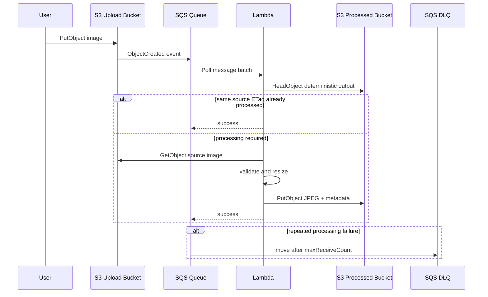

# Architecture Notes

## Goal

The project demonstrates a small but realistic asynchronous processing boundary. The important lesson is not image resizing itself; it is how work moves through AWS when producers and consumers operate at different speeds and failures must be recoverable.

## Data Flow

## Why S3 → SQS → Lambda?

Direct S3-to-Lambda invocation is simpler and can be correct for many systems. This repository intentionally inserts SQS to teach a stronger decoupling boundary.

SQS provides:

- buffering during bursts
- independent retry behavior
- a visible backlog
- a dead-letter path for poison messages
- a point where consumer concurrency can be controlled

The cost is extra latency, requests, configuration, and operational surface area.

## Delivery Semantics

Neither the architecture nor the code assumes exactly-once delivery. Repeated S3/SQS delivery must be safe enough to tolerate.

The processor therefore derives one deterministic output key from the source key and stores the source ETag as output-object metadata. A repeated event with the same ETag can be acknowledged without performing the resize again.

This approach has limitations:

- an ETag is not a universal content hash for every S3 upload method
- two events can race before either output is written
- changing processing settings does not automatically invalidate an old output

For workflows that require stronger coordination, a DynamoDB processing ledger or another explicit state store can be introduced and its conditional writes documented.

## Failure Boundaries

### Unsupported extension

The message is acknowledged and skipped. Retrying a `.txt` object will never turn it into a supported image.

### Corrupt image or oversized payload

The message fails and is retried. Repeated failure eventually sends it to the DLQ so the bad input becomes inspectable rather than silently disappearing.

### Temporary S3 or Lambda failure

SQS retains the message until the visibility timeout expires, then makes it eligible for another processing attempt.

### Partial batch failure

The Lambda event-source mapping receives `ReportBatchItemFailures`. The handler returns only failed message IDs, allowing successful messages from the same batch to be removed.

## Backpressure

The upload bucket can accept work faster than the function processes it. SQS queue depth and `ApproximateAgeOfOldestMessage` are therefore meaningful operational signals.

The template limits SQS-triggered Lambda concurrency to five. This is a teaching safeguard, not a universal production value. Real concurrency should be chosen from processing duration, downstream limits, account quotas, and latency targets.

## IAM Boundaries

The processor needs three data-plane capabilities:

1. read source objects from the upload bucket
2. read existing objects from the processed bucket for idempotency checks
3. write processed objects to the processed bucket

The SQS event source also requires polling permissions on the image queue. S3 receives a queue policy granting only `sqs:SendMessage`, constrained by source bucket ARN and source account.

## Observability

Lambda emits CloudWatch logs automatically. SQS and Lambda expose service metrics without application instrumentation.

The template creates one explicit DLQ alarm. It intentionally has no notification target so learners can decide how alerts should be routed. Useful extensions include:

- SNS notification from the DLQ alarm
- queue-age alarm for processing latency
- Lambda error/throttle alarms
- structured custom metrics for image dimensions and processing time

## Cost Model

The important cost drivers are workload dependent:

- number and size of S3 objects
- S3 request volume
- SQS request volume
- Lambda invocation count, memory, and duration
- CloudWatch log ingestion and retention
- alarm count
- data transfer patterns

The repository does not claim a fixed monthly cost because regional pricing and workload volume change the answer.
